# 🏥 DiagnoChain MVP - Decentralized Healthcare Data Management

<div align="center">


**Secure, decentralized healthcare data management powered by blockchain technology**

[](https://opensource.org/licenses/MIT)
[](https://nodejs.org/)
[](https://reactjs.org/)
[](https://www.mongodb.com/)
[](https://ethereum.org/)
[](https://lightning.network/)

[🚀 Quick Start](#quick-start) • [📖 Documentation](#documentation) • [🏗️ Architecture](#architecture) • [🔧 API](#api-reference) • [🤝 Contributing](#contributing)

</div>

---

## 📋 Table of Contents

- [Overview](#overview)
- [🏗️ Architecture](#architecture)
- [✨ Key Features](#key-features)
- [🛠️ Technology Stack](#technology-stack)
- [🚀 Quick Start](#quick-start)
- [📁 Project Structure](#project-structure)
- [🔧 Configuration](#configuration)
- [📖 API Reference](#api-reference)
- [🏥 Healthcare Features](#healthcare-features)
- [🔐 Security](#security)
- [🧪 Testing](#testing)
- [🚢 Deployment](#deployment)
- [🤝 Contributing](#contributing)
- [📄 License](#license)
- [📞 Support](#support)

---

## Overview

**DiagnoChain** is a revolutionary blockchain-powered healthcare data management platform that puts patients in control of their medical information. Built with cutting-edge technology, it ensures data privacy, security, and interoperability across healthcare providers.

### 🌟 Why DiagnoChain?

- **🔒 Patient-Controlled Data**: Patients own and control access to their medical records
- **⛓️ Blockchain Security**: Immutable, tamper-proof medical records
- **🏥 Provider Integration**: Seamless integration with existing healthcare systems
- **💰 Cost Efficiency**: Reduced administrative costs through automation
- **🌍 Global Interoperability**: Universal access to medical records across borders
- **🔐 Privacy First**: Advanced encryption and zero-knowledge proofs

---

## 🏗️ Architecture

DiagnoChain follows a modern microservices architecture with blockchain integration, designed for scalability, security, and healthcare compliance.

```mermaid
graph TB
    %% User Layer
    subgraph "👥 Users"
        P[👤 Patients]
        D[👨‍⚕️ Doctors]
        A[👩‍💼 Administrators]
    end

    %% Frontend Layer
    subgraph "🌐 Frontend Layer"
        subgraph "React Application"
            UI[🖥️ User Interface]
            WC[🔗 Wallet Connector]
            SM[📊 State Management]
        end
    end

    %% API Gateway
    subgraph "🚪 API Gateway"
        GW[🛡️ Gateway<br/>Rate Limiting<br/>Authentication<br/>Load Balancing]
    end

    %% Backend Services
    subgraph "⚙️ Backend Services"
        subgraph "Core Services"
            AUTH[🔐 Auth Service<br/>JWT + Wallet Auth]
            PAT[🏥 Patient Service<br/>Profile Management]
            MED[📋 Medical Records<br/>CRUD Operations]
            DOC[📄 Document Service<br/>File Management]
            APPT[📅 Appointment<br/>Scheduling]
        end
        
        subgraph "Blockchain Services"
            BC[⛓️ Blockchain Service<br/>Smart Contract Integration]
            WAL[💰 Wallet Service<br/>Transaction Management]
        end
        
        subgraph "External Integrations"
            PAY[💳 Payment Service<br/>Lightning Network]
            EMAIL[📧 Email Service<br/>Notifications]
            IPFS[🌐 IPFS Service<br/>Distributed Storage]
        end
    end

    %% Data Layer
    subgraph "💾 Data Layer"
        subgraph "Traditional Databases"
            MONGO[(🍃 MongoDB<br/>User Data<br/>Medical Records<br/>Metadata)]
            REDIS[(⚡ Redis<br/>Caching<br/>Sessions<br/>Queue)]
        end
        
        subgraph "Blockchain Networks"
            ETH[⟠ Ethereum<br/>Smart Contracts<br/>Access Control<br/>Data Integrity]
            BTC[₿ Bitcoin<br/>Lightning Network<br/>Micropayments<br/>Escrow]
        end
        
        subgraph "Distributed Storage"
            IPFSN[🌐 IPFS Network<br/>Encrypted Documents<br/>Medical Images<br/>Backup Data]
        end
    end

    %% Monitoring & DevOps
    subgraph "📊 Monitoring & DevOps"
        PROM[📈 Prometheus<br/>Metrics Collection]
        GRAF[📊 Grafana<br/>Dashboards]
        ELK[📋 ELK Stack<br/>Log Management]
        K8S[☸️ Kubernetes<br/>Container Orchestration]
    end

    %% External Systems
    subgraph "🏥 External Healthcare Systems"
        EHR[🏥 EHR Systems<br/>HL7/FHIR Integration]
        LAB[🧪 Laboratory<br/>Result Integration]
        PHARM[💊 Pharmacy<br/>Prescription Management]
        INS[🛡️ Insurance<br/>Claims Processing]
    end

    %% User Interactions
    P --> UI
    D --> UI
    A --> UI
    
    %% Frontend to Backend
    UI --> GW
    WC --> BC
    SM --> GW
    
    %% API Gateway routing
    GW --> AUTH
    GW --> PAT
    GW --> MED
    GW --> DOC
    GW --> APPT
    
    %% Service Interactions
    AUTH --> MONGO
    AUTH --> REDIS
    PAT --> MONGO
    PAT --> BC
    MED --> MONGO
    MED --> BC
    MED --> IPFS
    DOC --> IPFS
    DOC --> MONGO
    APPT --> MONGO
    APPT --> EMAIL
    
    %% Blockchain Integration
    BC --> ETH
    BC --> BTC
    WAL --> BTC
    PAY --> BTC
    
    %% Data Storage
    BC --> IPFSN
    MED --> IPFSN
    DOC --> IPFSN
    
    %% Monitoring
    AUTH --> PROM
    PAT --> PROM
    MED --> PROM
    PROM --> GRAF
    AUTH --> ELK
    PAT --> ELK
    MED --> ELK
    
    %% External Integrations
    MED --> EHR
    MED --> LAB
    APPT --> PHARM
    PAY --> INS
    
    %% Container Orchestration
    K8S -.-> AUTH
    K8S -.-> PAT
    K8S -.-> MED
    K8S -.-> DOC
    K8S -.-> APPT

    %% Styling
    classDef userClass fill:#e1f5fe,stroke:#01579b,stroke-width:2px
    classDef frontendClass fill:#f3e5f5,stroke:#4a148c,stroke-width:2px
    classDef backendClass fill:#e8f5e8,stroke:#1b5e20,stroke-width:2px
    classDef blockchainClass fill:#fff3e0,stroke:#e65100,stroke-width:2px
    classDef dataClass fill:#fce4ec,stroke:#880e4f,stroke-width:2px
    classDef externalClass fill:#f1f8e9,stroke:#33691e,stroke-width:2px
    
    class P,D,A userClass
    class UI,WC,SM frontendClass
    class AUTH,PAT,MED,DOC,APPT backendClass
    class BC,WAL,ETH,BTC blockchainClass
    class MONGO,REDIS,IPFSN dataClass
    class EHR,LAB,PHARM,INS externalClass
```



### 🔄 Data Flow Architecture

```mermaid
sequenceDiagram
    participant P as 👤 Patient
    participant F as 🌐 Frontend
    participant A as 🔐 Auth Service
    participant M as 📋 Medical Service
    participant B as ⛓️ Blockchain
    participant I as 🌐 IPFS
    participant D as 👨‍⚕️ Doctor

    Note over P,D: Medical Record Creation Flow
    
    P->>F: Upload medical document
    F->>A: Authenticate with wallet signature
    A-->>F: JWT + session token
    
    F->>M: Create medical record
    M->>I: Store encrypted document
    I-->>M: Return IPFS hash
    
    M->>B: Record metadata on blockchain
    B-->>M: Transaction hash
    M-->>F: Success response
    F-->>P: Record created confirmation

    Note over P,D: Access Grant Flow
    
    P->>F: Grant access to doctor
    F->>B: Execute smart contract
    B-->>F: Access granted
    
    D->>F: Request patient records
    F->>B: Verify access permissions
    B-->>F: Permission confirmed
    
    F->>M: Fetch medical records
    M->>I: Retrieve documents
    I-->>M: Encrypted documents
    M-->>F: Decrypted records
    F-->>D: Display patient data
```



---

## ✨ Key Features

### 🏥 **Healthcare Management**
- **📋 Medical Records**: Comprehensive medical history management
- **📄 Document Storage**: Secure storage for medical documents, images, and reports
- **📅 Appointment Scheduling**: Integrated calendar system for patients and providers
- **💊 Prescription Management**: Digital prescription tracking and verification
- **🧪 Lab Results Integration**: Automated lab result import and analysis
- **🏥 Provider Directory**: Searchable database of healthcare providers

### 🔐 **Security & Privacy**
- **🔑 Multi-Factor Authentication**: JWT tokens + wallet signatures + 2FA
- **🔒 End-to-End Encryption**: AES-256 encryption for all sensitive data
- **⛓️ Blockchain Integrity**: Immutable audit trails and data verification
- **🛡️ Access Controls**: Granular permissions system with time-based expiry
- **🔍 Zero-Knowledge Proofs**: Privacy-preserving data verification
- **📊 Audit Logging**: Comprehensive access and modification logs

### ⛓️ **Blockchain Integration**
- **📝 Smart Contracts**: Automated access control and data integrity
- **₿ Bitcoin Payments**: Lightning Network for micropayments and escrow
- **⟠ Ethereum Network**: Decentralized data verification and access management
- **🌐 IPFS Storage**: Distributed file storage for medical documents
- **🔄 Cross-Chain**: Multi-blockchain support for enhanced functionality
- **💰 Tokenization**: Native token for platform governance and incentives

### 🚀 **Modern Technology**
- **⚡ Real-Time Updates**: WebSocket connections for live data synchronization
- **📱 Progressive Web App**: Mobile-first design with offline capabilities
- **🔄 Auto-Scaling**: Kubernetes-based infrastructure that scales automatically
- **📊 Analytics Dashboard**: Comprehensive insights and reporting tools
- **🌍 Multi-Language**: Internationalization support for global deployment
- **♿ Accessibility**: WCAG 2.1 AA compliant for all users

---

## 🛠️ Technology Stack

### **Frontend** 🌐
```
React 18.2          TypeScript 4.9      Tailwind CSS 3.2
React Router 6.8    React Query 4.29    Framer Motion 10.12
Web3.js 4.0        Ethers.js 6.10      Chart.js 4.2
React Hook Form 7.43 React Toastify 9.1  Lucide React 0.263
```

### **Backend** ⚙️
```
Node.js 18.x       Express.js 4.18     TypeScript 4.9
MongoDB 6.0        Mongoose 7.0        Redis 7.0
JWT 9.0           Bcryptjs 2.4        Helmet 6.1
Multer 1.4        Nodemailer 6.9      Socket.io 4.6
```

### **Blockchain** ⛓️
```
Solidity 0.8.19    Hardhat 2.14        OpenZeppelin 4.8
Web3.js 4.0       Ethers.js 6.10      Truffle 5.8
Bitcoin Core       Lightning Network   IPFS 0.17
MetaMask          WalletConnect 2.7    Rainbow Kit 1.0
```

### **DevOps & Infrastructure** 🛠️
```
Docker 24.0        Kubernetes 1.26     Helm 3.11
Prometheus 2.42    Grafana 9.4         ELK Stack 8.6
Nginx 1.22        Let's Encrypt       GitHub Actions
AWS/GCP/Azure     Terraform 1.4       Ansible 2.14
```

### **Testing** 🧪
```
Jest 29.0         React Testing Lib   Cypress 12.0
Supertest 6.3     Mocha 10.2         Chai 4.3
Hardhat Test     Ganache CLI 6.12   Artillery 2.0
```

---

## 🚀 Quick Start

### Prerequisites

Ensure you have the following installed:

```bash
Node.js >= 18.0.0
MongoDB >= 6.0
Redis >= 7.0
Docker >= 24.0 (optional)
Git >= 2.30
```

### 🐳 Option 1: Docker Setup (Recommended)

```bash
# Clone the repository
git clone https://github.com/diagnochain/diagnochain-mvp.git
cd diagnochain-mvp

# Start all services with Docker Compose
docker-compose up -d

# Wait for services to initialize (about 2-3 minutes)
docker-compose logs -f

# Access the application
# Frontend: http://localhost:3000
# Backend API: http://localhost:3001
# MongoDB: localhost:27017
# Redis: localhost:6379
```

### 💻 Option 2: Local Development Setup

```bash
# 1. Clone and setup
git clone https://github.com/diagnochain/diagnochain-mvp.git
cd diagnochain-mvp

# 2. Install backend dependencies
cd backend
npm install

# 3. Install frontend dependencies
cd ../frontend
npm install

# 4. Setup environment variables
cd ../backend
cp .env.example .env
# Edit .env with your configuration

cd ../frontend
cp .env.example .env
# Edit .env with your configuration

# 5. Start MongoDB and Redis
# MongoDB: mongod --config /usr/local/etc/mongod.conf
# Redis: redis-server

# 6. Setup blockchain (optional for local development)
cd ../contracts
npm install
npx hardhat compile
npx hardhat node # In separate terminal
npx hardhat run scripts/deploy.js --network localhost

# 7. Start the applications
cd ../backend
npm run dev

# In new terminal
cd ../frontend  
npm start

# Access the application at http://localhost:3000
```

### 🔑 Initial Setup

1. **Create Admin Account**: 
   ```bash
   cd backend
   npm run seed:admin
   ```

2. **Setup Blockchain Contracts**:
   ```bash
   cd contracts
   npm run deploy:local
   ```

3. **Configure Wallet**: Connect MetaMask to `http://localhost:8545`

4. **Access Application**: Navigate to `http://localhost:3000`

---

## 📁 Project Structure

```
diagnochain-mvp/
├── 📁 contracts/              # Solidity smart contracts
│   ├── 📁 core/              # Main business logic contracts  
│   ├── 📁 interfaces/        # Contract interfaces
│   ├── 📁 libraries/         # Reusable contract libraries
│   └── 📁 test-helpers/      # Mock contracts for testing
│
├── 📁 frontend/              # React application
│   ├── 📁 src/
│   │   ├── 📁 components/    # React components
│   │   │   ├── 📁 patient/   # Patient-specific UI
│   │   │   ├── 📁 doctor/    # Doctor-specific UI  
│   │   │   └── 📁 shared/    # Reusable components
│   │   ├── 📁 hooks/         # Custom React hooks
│   │   ├── 📁 services/      # API calls & web3 integration
│   │   ├── 📁 utils/         # Helper functions
│   │   └── 📁 styles/        # CSS and styling
│   └── 📁 public/           # Static assets
│
├── 📁 backend/               # Node.js/Express API
│   └── 📁 src/
│       ├── 📁 routes/        # API route definitions
│       ├── 📁 controllers/   # Business logic handlers  
│       ├── 📁 middleware/    # Auth, validation, logging
│       ├── 📁 services/      # External service integrations
│       ├── 📁 models/        # Data models & ORM
│       └── 📁 utils/         # Backend utilities
│
├── 📁 bitcoin/               # Bitcoin/Lightning integration
│   ├── 📁 lightning/         # Lightning Network services
│   ├── 📁 wallet/           # BTC wallet management
│   ├── 📁 escrow/           # Multi-sig escrow logic
│   └── 📁 oracles/          # Price feeds & external data
│
├── 📁 database/              # Database management
│   ├── 📁 migrations/       # Schema version control
│   ├── 📁 seeds/            # Test data
│   └── 📁 schemas/          # Table definitions
│
├── 📁 tests/                 # Comprehensive testing
│   ├── 📁 unit/             # Individual component tests
│   ├── 📁 integration/      # Multi-component tests  
│   ├── 📁 e2e/              # Full user flow tests
│   └── 📁 security/         # Penetration & vulnerability tests
│
├── 📁 infrastructure/        # DevOps & deployment
│   ├── 📁 docker/          # Container configurations
│   ├── 📁 k8s/             # Kubernetes manifests
│   └── 📁 monitoring/      # Observability setup
│
├── 📁 docs/                  # Project documentation
│   ├── 📁 api/              # API documentation
│   ├── 📁 architecture/     # System design docs
│   └── 📁 guides/           # User & developer guides
│
└── 📁 scripts/              # Automation scripts
    ├── 📁 deployment/       # Deploy automation
    ├── 📁 utilities/        # Data migration, etc.
    └── 📁 testing/          # Test automation
```

---

## 🔧 Configuration

### Backend Environment Variables

```bash
# Server Configuration
NODE_ENV=development
PORT=3001
API_VERSION=v1

# Database Configuration  
DB_HOST=localhost
DB_PORT=27017
DB_NAME=diagnochain
DB_USER=your_username
DB_PASSWORD=your_password

# Redis Configuration
REDIS_HOST=localhost
REDIS_PORT=6379
REDIS_PASSWORD=your_redis_password

# JWT Configuration
JWT_SECRET=your_super_secret_jwt_key
JWT_REFRESH_SECRET=your_refresh_secret
JWT_EXPIRE_TIME=15m
JWT_REFRESH_EXPIRE_TIME=30d

# Blockchain Configuration
WEB3_PROVIDER_URL=http://localhost:8545
CHAIN_ID=1337
PATIENT_REGISTRY_ADDRESS=0x...
MEDICAL_RECORDS_ADDRESS=0x...
ACCESS_CONTROL_ADDRESS=0x...

# Bitcoin/Lightning Configuration
BTC_NETWORK=testnet
LIGHTNING_ENABLED=true
LIGHTNING_ENDPOINT=http://localhost:8080

# IPFS Configuration  
IPFS_PROVIDER=local
LOCAL_IPFS_URL=http://localhost:5001

# Email Configuration
EMAIL_PROVIDER=sendgrid
SENDGRID_API_KEY=your_sendgrid_key
FROM_EMAIL=noreply@diagnochain.com

# Storage Configuration
UPLOAD_PATH=./uploads
MAX_FILE_SIZE=50mb
ALLOWED_FILE_TYPES=jpg,jpeg,png,pdf,doc,docx

# Security Configuration
ENCRYPTION_KEY=your_encryption_key
CORS_ORIGIN=http://localhost:3000
RATE_LIMIT_WINDOW=15m
RATE_LIMIT_MAX=100

# Monitoring
LOG_LEVEL=info
SENTRY_DSN=your_sentry_dsn
```

### Frontend Environment Variables

```bash
# API Configuration
REACT_APP_API_URL=http://localhost:3001/api
REACT_APP_WS_URL=ws://localhost:3001

# Blockchain Configuration
REACT_APP_NETWORK=localhost
REACT_APP_CHAIN_ID=1337
REACT_APP_PATIENT_REGISTRY_LOCAL=0x...
REACT_APP_MEDICAL_RECORDS_LOCAL=0x...

# External Services
REACT_APP_IPFS_GATEWAY=http://localhost:8080/ipfs/
REACT_APP_BLOCKCHAIN_EXPLORER=http://localhost:8545

# Feature Flags
REACT_APP_ENABLE_LIGHTNING=true
REACT_APP_ENABLE_BIOMETRIC=false
REACT_APP_ENABLE_ANALYTICS=true

# Analytics
REACT_APP_GA_MEASUREMENT_ID=GA_MEASUREMENT_ID
REACT_APP_SENTRY_DSN=your_frontend_sentry_dsn
```

---

## 📖 API Reference

### Authentication Endpoints

```http
POST   /api/auth/register          # Register new user
POST   /api/auth/login             # Email/password login
POST   /api/auth/wallet-login      # Wallet signature login
POST   /api/auth/logout            # Logout user
POST   /api/auth/refresh           # Refresh JWT token
GET    /api/auth/profile           # Get user profile
PUT    /api/auth/profile           # Update user profile
POST   /api/auth/forgot-password   # Request password reset
POST   /api/auth/reset-password    # Reset password
POST   /api/auth/verify-email      # Verify email address
```

### Patient Management

```http
GET    /api/patients               # Get all patients (doctors only)
GET    /api/patients/my-profile    # Get patient's own profile  
GET    /api/patients/:id           # Get specific patient
POST   /api/patients               # Create patient (admin only)
PUT    /api/patients/:id           # Update patient
DELETE /api/patients/:id           # Delete patient (admin only)
```

### Medical Records

```http
GET    /api/medical-records        # Get patient's medical records
GET    /api/medical-records/:id    # Get specific record
POST   /api/medical-records        # Create new record
PUT    /api/medical-records/:id    # Update existing record  
DELETE /api/medical-records/:id    # Delete record
POST   /api/medical-records/:id/share  # Share record
```

### Document Management

```http
GET    /api/documents              # Get patient's documents
POST   /api/documents/upload       # Upload new document
GET    /api/documents/:id          # Get specific document
GET    /api/documents/:id/download # Download document
DELETE /api/documents/:id          # Delete document
```

### Access Control

```http
GET    /api/access-grants          # Get access grants
POST   /api/access-grants          # Grant access to doctor
DELETE /api/access-grants/:id      # Revoke access
GET    /api/access-logs            # Get access audit logs
```

### Blockchain Operations

```http
GET    /api/blockchain/records     # Get blockchain records
POST   /api/blockchain/verify/:id  # Verify data integrity  
GET    /api/blockchain/stats       # Get blockchain statistics
POST   /api/blockchain/backup      # Create blockchain backup
```

### Example API Response

```json
{
  "success": true,
  "message": "Medical record created successfully",
  "data": {
    "id": "648f1a2b3c4d5e6f7890abcd",
    "patientId": "648f1a2b3c4d5e6f7890abce",
    "recordType": "diagnosis",
    "title": "Annual Physical Examination",
    "description": "Comprehensive annual physical examination with normal findings",
    "doctorId": "648f1a2b3c4d5e6f7890abcf",
    "doctorName": "Dr. Sarah Johnson",
    "createdAt": "2023-06-18T10:30:00.000Z",
    "updatedAt": "2023-06-18T10:30:00.000Z",
    "blockchain": {
      "transactionHash": "0xabc123...",
      "blockNumber": 12345,
      "verified": true
    },
    "metadata": {
      "bloodPressure": "120/80",
      "heartRate": "72 bpm",
      "weight": "70 kg",
      "height": "175 cm"
    }
  },
  "timestamp": "2023-06-18T10:30:00.000Z"
}
```

---

## 🏥 Healthcare Features

### 👤 **Patient Portal**

**Personal Health Dashboard**
- Comprehensive health metrics visualization
- Medical history timeline with interactive filters
- Upcoming appointments and medication reminders  
- Real-time health data from connected devices
- Secure family health sharing capabilities

**Medical Record Management**
- Upload and organize medical documents
- OCR text extraction from scanned documents
- Version control for updated medical records
- Smart categorization using ML algorithms
- Integration with popular health apps and devices

**Access Control Center**
- Granular permission management for healthcare providers
- Temporary access grants with automatic expiration
- Real-time access monitoring and audit trails
- Emergency access protocols for critical situations
- Consent management with digital signatures

### 👨‍⚕️ **Doctor Portal**

**Patient Management System**  
- Comprehensive patient profiles with medical history
- Advanced search and filtering capabilities
- Risk assessment tools and clinical decision support
- Integration with existing EHR systems (HL7/FHIR)
- Telemedicine capabilities with video consultations

**Clinical Tools**
- Digital prescription management with drug interaction checking
- Lab result integration with trend analysis
- Clinical note templates and voice-to-text capability
- Medical image viewing with DICOM support
- Care plan creation with collaborative features

**Practice Analytics**
- Patient outcome tracking and quality metrics
- Revenue cycle management and billing integration  
- Appointment scheduling optimization
- Performance dashboards with custom KPIs
- Compliance reporting and audit trail management

### 👩‍💼 **Administrator Dashboard**

**System Management**
- User role and permission management
- System health monitoring and alerting
- Data backup and disaster recovery tools
- Security audit logs and threat detection
- Performance optimization and scaling controls

**Healthcare Network**
- Provider directory management
- Inter-facility data sharing protocols
- Quality assurance and compliance monitoring
- Analytics and reporting across the network
- Integration management for third-party systems

---

## 🔐 Security

DiagnoChain implements enterprise-grade security measures to protect sensitive healthcare data:

### 🛡️ **Multi-Layer Security Architecture**

```mermaid
graph TB
    subgraph "🌐 Application Layer"
        WAF[🛡️ Web Application Firewall]
        DDOS[⚡ DDoS Protection]
        SSL[🔒 SSL/TLS Encryption]
    end
    
    subgraph "🔐 Authentication Layer"  
        MFA[🔑 Multi-Factor Authentication]
        JWT[🎫 JWT Tokens]
        WALLET[👛 Wallet Signatures]
        BIOMETRIC[👆 Biometric Authentication]
    end
    
    subgraph "🏗️ Authorization Layer"
        RBAC[👥 Role-Based Access Control]
        ABAC[📋 Attribute-Based Access Control] 
        TIMEAC[⏰ Time-Based Access Control]
        LOCATION[🌍 Location-Based Access Control]
    end
    
    subgraph "💾 Data Layer"
        E2E[🔒 End-to-End Encryption]
        AES[🛡️ AES-256 Encryption]
        HASH[# Hash Functions]
        SALT[🧂 Salt & Pepper]
    end
    
    subgraph "⛓️ Blockchain Layer"
        SMART[📝 Smart Contract Security]
        MULTISIG[🔐 Multi-Signature Wallets]
        AUDIT[🔍 Immutable Audit Trails]
        CONSENSUS[🤝 Consensus Verification]
    end
    
    WAF --> MFA
    DDOS --> JWT
    SSL --> WALLET
    
    MFA --> RBAC
    JWT --> ABAC
    WALLET --> TIMEAC
    BIOMETRIC --> LOCATION
    
    RBAC --> E2E
    ABAC --> AES
    TIMEAC --> HASH
    LOCATION --> SALT
    
    E2E --> SMART
    AES --> MULTISIG
    HASH --> AUDIT
    SALT --> CONSENSUS
```



### 🔒 **Security Features**

- **🔐 Zero-Trust Architecture**: Never trust, always verify principle
- **🛡️ HIPAA Compliance**: Full compliance with healthcare data regulations
- **🔒 Data Encryption**: AES-256 encryption for data at rest and in transit
- **🔑 Key Management**: Hardware Security Modules (HSM) for key protection
- **🚨 Threat Detection**: AI-powered anomaly detection and monitoring
- **🔒 Secure Enclaves**: Intel SGX for protecting sensitive computations
- **🔐 Homomorphic Encryption**: Computation on encrypted data
- **🛡️ Differential Privacy**: Privacy-preserving data analysis

### 🏥 **Healthcare Compliance**

| Regulation | Status | Implementation |
|------------|--------|----------------|
| **HIPAA** | ✅ Compliant | End-to-end encryption, access logs, BAA agreements |
| **GDPR** | ✅ Compliant | Right to erasure, data portability, consent management |
| **HITECH** | ✅ Compliant | Breach notification, audit controls, integrity controls |
| **21 CFR Part 11** | ✅ Compliant | Electronic signatures, audit trails, system validation |
| **ISO 27001** | ✅ Certified | Information security management system |
| **SOC 2 Type II** | ✅ Certified | Security, availability, confidentiality controls |

---

## 🚢 Deployment

DiagnoChain supports multiple deployment strategies for different environments:

### ☸️ **Kubernetes Deployment (Recommended)**

```bash
# Deploy to Kubernetes cluster
kubectl apply -f infrastructure/k8s/

# Monitor deployment
kubectl get pods -n diagnochain
kubectl logs -f deployment/diagnochain-backend -n diagnochain

# Access via LoadBalancer
kubectl get svc diagnochain-frontend -n diagnochain
```

### 🐳 **Docker Compose (Development)**

```bash
# Start all services
docker-compose -f docker-compose.prod.yml up -d

# Scale services
docker-compose up --scale backend=3 --scale frontend=2

# Monitor logs
docker-compose logs -f
```

### ☁️ **Cloud Deployments**

**AWS Deployment**
```bash
# Deploy with Terraform
cd infrastructure/terraform/aws
terraform init
terraform plan
terraform apply

# Deploy with AWS EKS
eksctl create cluster --config-file=eks-cluster.yaml
kubectl apply -f ../k8s/
```

**Google Cloud Deployment**
```bash
# Deploy to GKE
gcloud container clusters create diagnochain-cluster
kubectl apply -f infrastructure/k8s/
```

**Azure Deployment**  
```bash
# Deploy to AKS
az aks create --resource-group diagnochain --name diagnochain-cluster
kubectl apply -f infrastructure/k8s/
```

### 🌍 **Environment Configurations**

| Environment | Description | Configuration |
|-------------|-------------|---------------|
| **Development** | Local development with hot reload | `docker-compose.dev.yml` |
| **Staging** | Pre-production testing environment | `docker-compose.staging.yml` |
| **Production** | Live production environment | `docker-compose.prod.yml` |
| **Testing** | Automated testing environment | `docker-compose.test.yml` |

---

## 📄 License

This project is licensed under the **MIT License** - see the [LICENSE](LICENSE) file for details.

```
MIT License

Copyright (c) 2023 Malak Parmar

Permission is hereby granted, free of charge, to any person obtaining a copy
of this software and associated documentation files (the "Software"), to deal
in the Software without restriction, including without limitation the rights
to use, copy, modify, merge, publish, distribute, sublicense, and/or sell
copies of the Software, and to permit persons to whom the Software is
furnished to do so, subject to the following conditions:

The above copyright notice and this permission notice shall be included in all
copies or substantial portions of the Software.

THE SOFTWARE IS PROVIDED "AS IS", WITHOUT WARRANTY OF ANY KIND, EXPRESS OR
IMPLIED, INCLUDING BUT NOT LIMITED TO THE WARRANTIES OF MERCHANTABILITY,
FITNESS FOR A PARTICULAR PURPOSE AND NONINFRINGEMENT. IN NO EVENT SHALL THE
AUTHORS OR COPYRIGHT HOLDERS BE LIABLE FOR ANY CLAIM, DAMAGES OR OTHER
LIABILITY, WHETHER IN AN ACTION OF CONTRACT, TORT OR OTHERWISE, ARISING FROM,
OUT OF OR IN CONNECTION WITH THE SOFTWARE OR THE USE OR OTHER DEALINGS IN THE
SOFTWARE.
```

---
